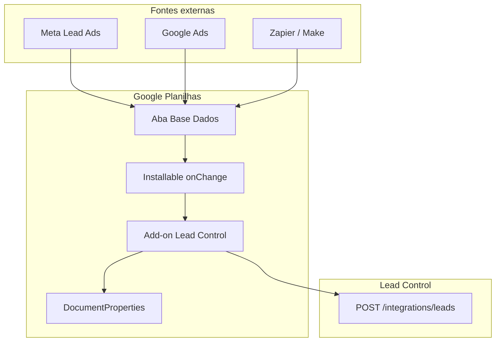

# Arquitetura

## Propósito

O add-on monitora uma aba configurada da planilha do cliente e, quando novas linhas são adicionadas (tipicamente por integrações automáticas de tráfego pago), mapeia os dados para o formato da API Lead Control e envia um POST para cada lead válido.

## Fluxo de dados



## Por que onChange e não onEdit?

Integrações externas escrevem na planilha via **Google Sheets API**. O trigger `onEdit` **não dispara** para alterações feitas por API — apenas para edições manuais do usuário.

O trigger installable `onChange` dispara tanto para edições manuais quanto para alterações via API, incluindo append de novas linhas.

Como `onChange` não informa qual linha mudou, o add-on mantém um cursor `lastProcessedRow` em `DocumentProperties` e processa linhas de `lastProcessedRow + 1` até `sheet.getLastRow()`.

## Estrutura de módulos

```
src/
├── main.ts                 # Entry point; exporta funções globais para o GAS
├── appsscript.json         # Manifest (scopes, add-on config)
├── types.ts                # Tipos e constantes compartilhados
├── config/settings.ts      # Leitura/gravação de DocumentProperties
├── mapping/leadMapper.ts   # Mapeamento colunas PT → payload API
├── api/leadClient.ts       # UrlFetchApp POST para Lead Control
├── triggers/
│   ├── triggerManager.ts   # Criação/remoção de triggers installable
│   └── onChangeHandler.ts  # Handler principal + processamento de linhas
└── ui/
    ├── homepage.ts         # CardService — painel de configuração
    └── notifications.ts    # Toasts na planilha
```

## Persistência de configuração

Cada planilha armazena sua própria configuração em `PropertiesService.getDocumentProperties()`:

| Chave | Tipo | Descrição |
|-------|------|-----------|
| `apiEndpoint` | string | URL do endpoint POST |
| `apiKey` | string | Chave `x-api-key` |
| `companyId` | string | ID da empresa no Lead Control |
| `sheetName` | string | Nome da aba monitorada (default: `Base Dados`) |
| `enabled` | boolean | Integração ativa/inativa |
| `lastProcessedRow` | number | Cursor da última linha processada |

## Build e deploy

TypeScript em `src/` é compilado com esbuild para um único bundle `dist/Code.js`. O manifest `src/appsscript.json` é copiado para `dist/`. O clasp envia apenas o conteúdo de `dist/` para o projeto Apps Script.

## Proteções

- **Debounce** (5s via CacheService): evita múltiplos POSTs quando integrações preenchem várias células da mesma linha
- **Cursor inicial**: ao salvar config pela primeira vez, `lastProcessedRow` = última linha atual (não reenvia histórico)
- **Validação local**: campos obrigatórios verificados antes do POST
- **Reautorização**: padrão Google com `ScriptApp.getAuthorizationInfo()` + e-mail de alerta

## Funções globais expostas

| Função | Invocada por |
|--------|-------------|
| `onSheetsHomepage` | Manifest `homepageTrigger` |
| `onChangeHandler` | Trigger installable onChange |
| `onInstall` | Instalação do add-on |
| `handleSaveConfiguration` | Botão "Salvar e ativar" |
| `handleDisableIntegration` | Botão "Desativar integração" |
| `handleTestLastRow` | Botão "Testar envio" |
| `handleReprocessLastRow` | Botão "Reprocessar última linha" |
